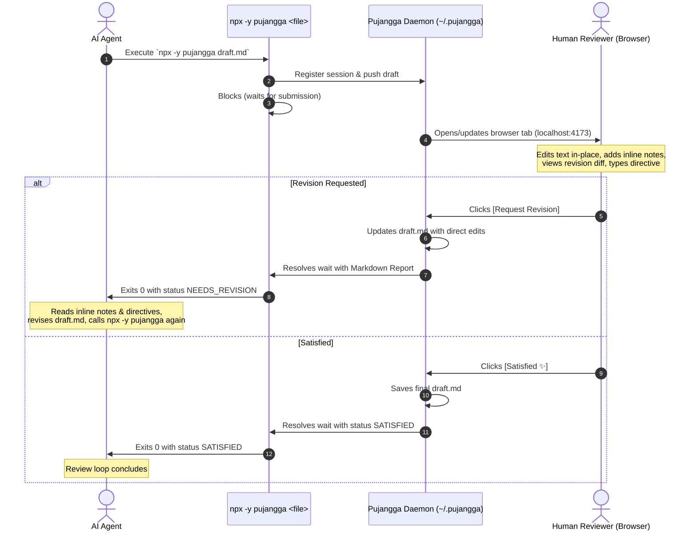

# 🖋️ Pujangga

> **Pujangga** (*Indonesian/Malay: poet, author, man of letters*) — An editorial-grade, harness-agnostic writing review surface for human-in-the-loop AI generation.

---

## 🌟 What is Pujangga?

AI agents write drafts quickly, but reviewing long-form prose inside terminal windows or chat bubbles is clumsy:
- You cannot easily leave inline feedback on a specific phrase or sentence.
- You cannot make quick in-place editorial tweaks without copying back and forth.
- Multi-round revision loops lose context between iterations.

**Pujangga** provides a distraction-free, literary web canvas. An AI agent invokes `npx -y pujangga <file>`, and Pujangga launches a persistent local review tab where you can:
1. **Highlight text to attach inline critique pins** (`📌`).
2. **Directly edit the draft in-place** in a Notion/Google Docs-style WYSIWYG editor.
3. **Write overall review directives & CTA buttons on the right side** (automatically docks to the bottom on smaller viewports).
4. **Compare revision diffs** between consecutive agent rounds.
5. **Audit resolved comments** from previous iterations.
6. **Request revisions or approve with one click**, automatically returning structured Markdown directives to the agent.
7. **Read comfortably in dark mode** with rich typography and crisp high-contrast formatting.

---

## 🚀 Instant Installation (Zero Build Required)

Pujangga is designed to be installed with **one command** without needing any manual `pnpm install` or `pnpm build`:

```bash
# Add to your AI agents (Gemini Antigravity, Claude Code, Cursor, etc.)
npx skills add visualnaut/pujangga
```

That's it! The skill is immediately recognized and ready to use.

---

## 💻 Manual Usage

You can also run Pujangga directly from any terminal on any markdown file:

```bash
# Direct execution via npx (zero installation)
npx -y pujangga draft.md

# Or if cloned locally:
./bin/pujangga draft.md
```

### CLI Options

| Command | Description |
| :--- | :--- |
| `pujangga <file>` | Submit or resume a document review in the browser |
| `pujangga review <file>` | Explicit review subcommand (alias) |
| `pujangga <file> --no-open` | Review session without auto-opening the browser |
| `pujangga status` | View daemon PID, port, uptime, and active sessions |
| `pujangga stop` | Gracefully stop the background daemon |
| `pujangga reset` | Reset the entire database and session history (with confirmation prompt, or `-y` to skip) |

---

## 🤖 How the Agent Review Loop Works



---

## 🎨 UI & Design Features

- **Responsive Editorial Layout**: On desktop screens, your Overall Review Directive and CTA action buttons live in a clean sticky right-hand rail beside the writing canvas. On mobile and tablet screens, they smoothly collapse into a docked bottom action bar.
- **True Dark Mode Contrast**: Thoughtfully tuned typography, high-contrast headings, amber highlight accents, and custom code block styling.
- **Persistent Daemon**: A single lightweight background daemon (`~/.pujangga/`) keeps your browser tab connected via WebSockets, eliminating broken connections between rounds.

---

## ⚖️ License

MIT
