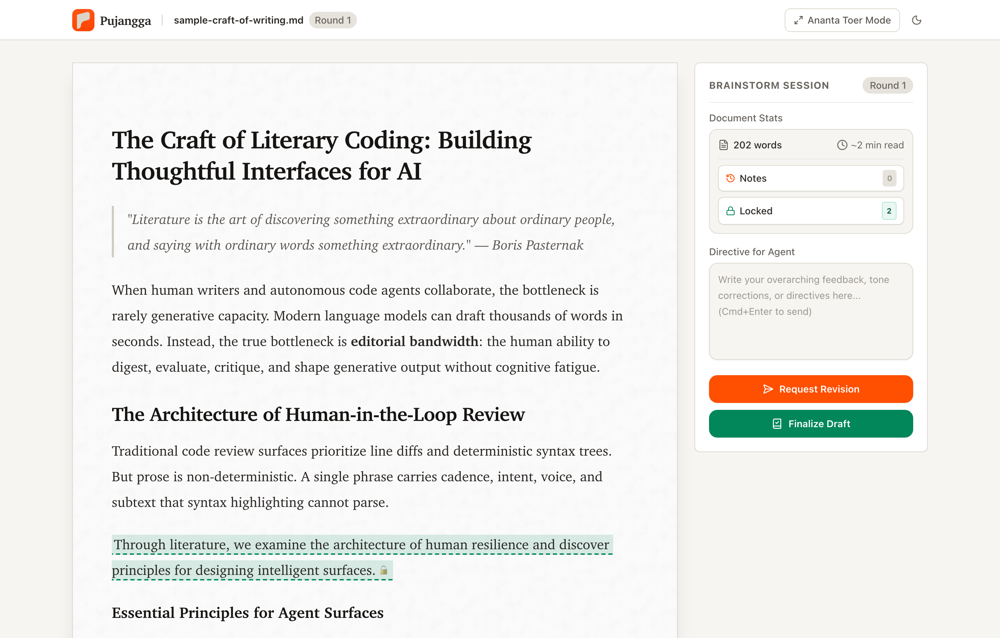
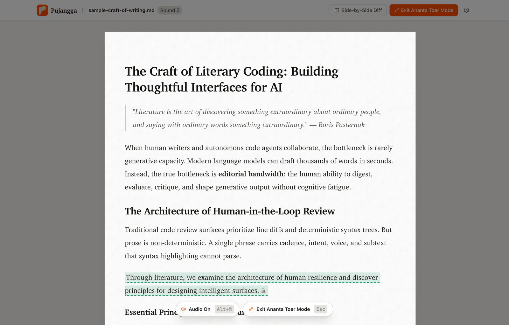
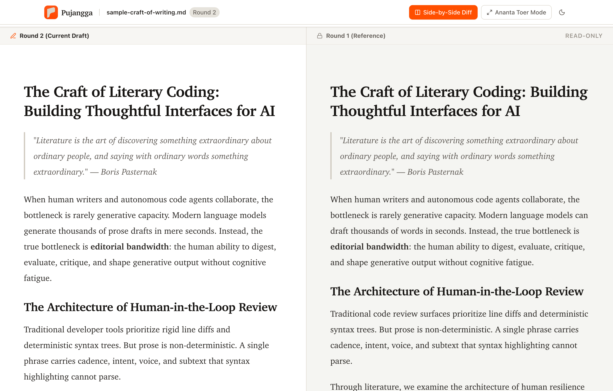
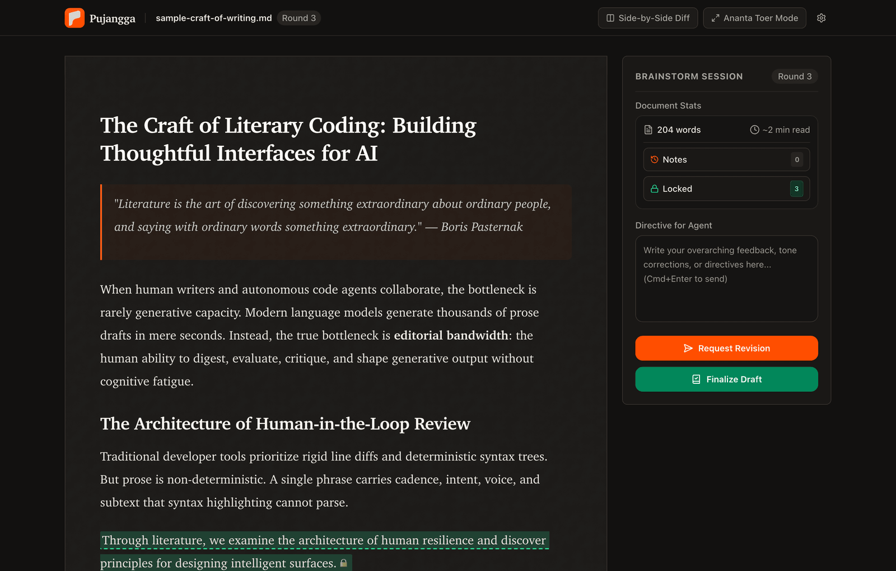
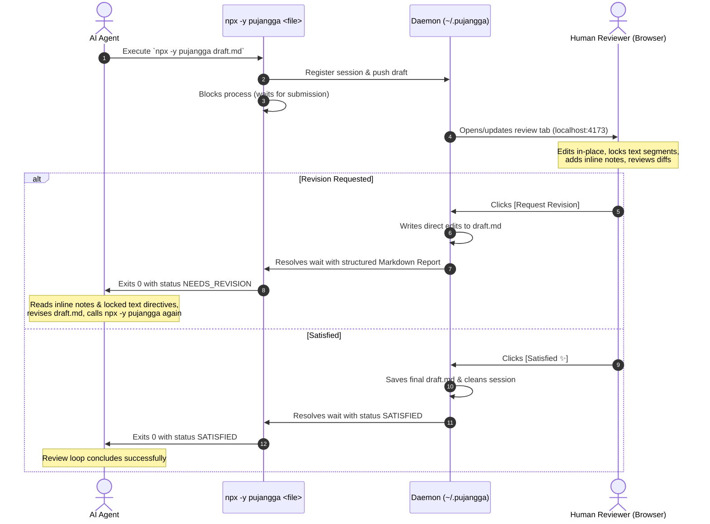

<p align="center">
  
</p>

<h1 align="center">🖋️ Pujangga</h1>

<p align="center">
  <strong>An editorial-grade, harness-agnostic writing review surface for human-in-the-loop AI generation.</strong>
</p>

<p align="center">
  <a href="https://www.npmjs.com/package/pujangga"></a>
  <a href="#-quick-start"></a>
  <a href="LICENSE"></a>
  <a href="https://nodejs.org">= 20" /></a>
  <a href="https://www.typescriptlang.org/"></a>
  <a href="https://tailwindcss.com"></a>
</p>

---

## 📖 Overview

AI agents write drafts quickly, but reviewing long-form prose inside terminal output or chat bubbles is clumsy:
- **No Sentence-Level Anchoring:** You cannot pin inline critique to a specific phrase or sentence.
- **Rewriting Approved Work:** Agents frequently rewrite parts of the text you already liked and wanted to keep.
- **Copy-Paste Friction:** Making quick, minor editorial polish requires copying back and forth across contexts.
- **Context Drift:** Multi-round revision loops lose context between iterations.

**Pujangga** (*Indonesian/Malay: poet, author, man of letters*) bridges the gap between human editorial craftsmanship and autonomous AI generation. When your agent invokes `npx -y pujangga <file>`, Pujangga launches a persistent local review canvas in your browser where you can critique, polish, lock text, and steer the revision loop in real time.

<p align="center">
  
</p>

---

## ✨ Key Features

### 📌 Inline Comment Pins
Highlight any phrase, clause, or paragraph to attach an inline critique pin (`📌`). Notes stay anchored to their target text and generate structured feedback for the agent.

### 🔒 Contextual Text Locking
Select text you want preserved and click **Lock**. Locked segments are protected against deletion in the editor and transmitted to the agent as strict immutable directives, preventing agents from altering approved passages across subsequent revision rounds.

### ✍️ In-Place Editorial WYSIWYG
Directly polish typos, rewrite sentences, or reformat headings inside the rich-text editor (built on ProseMirror & Tiptap). When you submit your review, your direct edits are automatically merged into the target file on disk.

### 🧘 Ananta Toer Mode (Deep Focus)
Press <kbd>Cmd</kbd> + <kbd>Shift</kbd> + <kbd>F</kbd> to enter **Ananta Toer Mode** — a distraction-free writing sanctuary named after Indonesian literary master Pramoedya Ananta Toer. The sidebar collapses, the writing canvas centers, and an ambient background veil smoothly deepens from 50% to 90% opacity over 3 minutes.

<p align="center">
  
</p>

### 🔄 Visual Revision Diffing
Compare consecutive revision rounds with high-contrast, word-level insertions and deletions. Easily verify whether the agent addressed your critique or changed text outside of scope.

<p align="center">
  
</p>

### 📊 Live Document Telemetry
Real-time word count and estimated reading duration update continuously in the sidebar as you type and edit.

### 🌓 Tactile Paper Surface & True Dark Mode
Crafted with an authentic paper noise texture and warm editorial typography (`ui-serif`, Charter, Georgia). Seamlessly toggle between **Paper** (light) and **Night** (dark) modes without jarring color flashes or contrast regressions.

<p align="center">
  
</p>

### ⚡ Zero-Config Background Daemon
A lightweight, background daemon (`~/.pujangga/`) manages SQLite state and live WebSocket synchronization across browser refreshes and agent rounds.

---

## 🚀 Quick Start

### 1. For AI Coding Assistants (Agent Skills)

Pujangga is packaged as a standard agent skill. Install it into your agent with a single command:

```bash
# Gemini Antigravity, Claude Code, Cursor, Windsurf, etc.
npx skills add visualnaut/pujangga
```

Once installed, your agent will autonomously use Pujangga whenever writing or reviewing long-form content.

### 2. Manual CLI Execution

You can also run Pujangga directly on any Markdown file from your terminal:

```bash
# Instant execution with npx (zero installation required)
npx -y pujangga draft.md

# Or run without auto-opening the browser
npx -y pujangga draft.md --no-open
```

### 3. Local Development

```bash
git clone https://github.com/visualnaut/pujangga.git
cd pujangga
pnpm install
pnpm build
./bin/pujangga draft.md
```

---

## 🤖 The Agent-Review Loop



---

## ⌨️ CLI Command Reference

| Command | Description |
| :--- | :--- |
| `pujangga <file>` | Open or resume a review session in your browser |
| `pujangga review <file>` | Explicit alias for reviewing a file |
| `pujangga <file> --no-open` | Start review session without auto-launching browser |
| `pujangga status` | View background daemon PID, port, uptime, and active sessions |
| `pujangga stop` | Gracefully shut down the background daemon |
| `pujangga reset` | Wipe session database and reset daemon state (`-y` to skip prompt) |

---

## ⌨️ Keyboard Shortcuts

| Shortcut | Action |
| :--- | :--- |
| <kbd>Cmd</kbd> / <kbd>Ctrl</kbd> + <kbd>Shift</kbd> + <kbd>F</kbd> | Toggle Ananta Toer Mode (distraction-free focus) |
| <kbd>Esc</kbd> | Exit Ananta Toer Mode / Close active drawer or modal |
| <kbd>Cmd</kbd> / <kbd>Ctrl</kbd> + <kbd>Enter</kbd> | Submit revision request from directive input |
| <kbd>Cmd</kbd> / <kbd>Ctrl</kbd> + <kbd>Z</kbd> | Undo text edits in the editor |
| <kbd>Cmd</kbd> / <kbd>Ctrl</kbd> + <kbd>Shift</kbd> + <kbd>Z</kbd> | Redo text edits in the editor |

---

## 🛡️ Built-In Editorial Guards

- **Locked Text Protection:** Locked passages cannot be deleted via Backspace, Cut (<kbd>Cmd</kbd>+<kbd>X</kbd>), or Select-All (<kbd>Cmd</kbd>+<kbd>A</kbd> + Delete). A warning banner alerts you to unlock the segment first.
- **Undo/Redo History Immunity:** Metadata actions (locking text or adding review notes) do not pollute the text undo/redo stack. Pressing <kbd>Cmd</kbd>+<kbd>Z</kbd> only reverts writing edits, leaving lock marks and comment pins intact.
- **Empty Revision Guard:** Prevents accidental revision submissions when no inline notes, locked text directives, or overall comments have been provided.

---

## ⚖️ License

Distributed under the [MIT License](LICENSE). Made with precision by [visualnaut](https://github.com/visualnaut).
