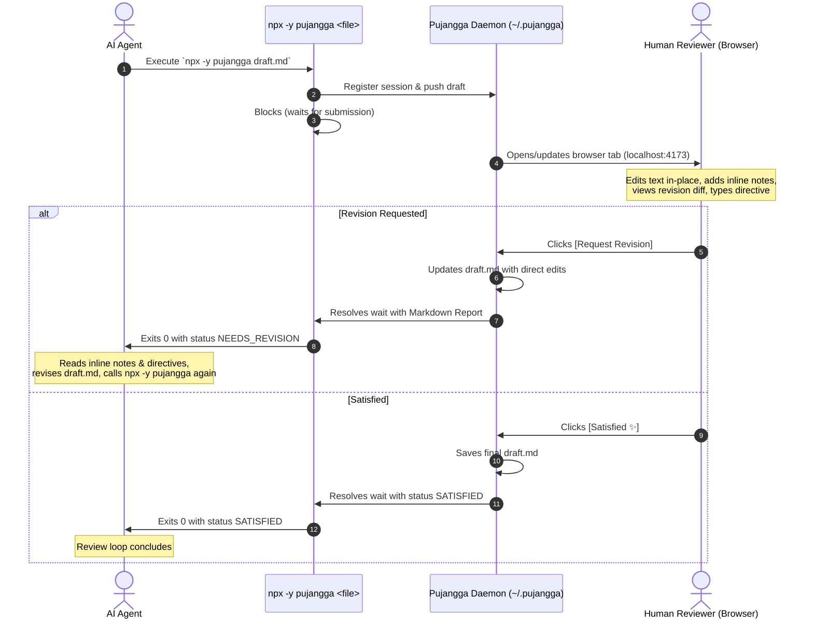

# Pujangga: Writing Review Surface

Pujangga opens agent-generated writing in a distraction-free, editorial web review canvas so the human editor can highlight sentences, attach inline comment pins (`📌`), directly edit text in-place, inspect revision diffs, and send feedback back to the agent in iterative rounds until satisfied.

## How to Invoke

You do not need pujangga installed globally. Invoke it directly with:
```bash
npx -y pujangga "<markdown-file>"
```
(or `pujangga "<markdown-file>"` if available in path).

## How the Review Loop Works



## Step-by-Step Agent Protocol

### 1. Write Initial Draft to File
Write your initial draft to a Markdown file in the user's workspace (e.g. `article.md` or `docs/spec.md`).

### 2. Initiate Review Round
Invoke the review command in the terminal:
```bash
npx -y pujangga "article.md"
```
*Note: This command will block while the human editor reviews the document in their browser. Do NOT poll or kill the command.*

### 3. Parse the Markdown Feedback Report
When the user submits, `pujangga` will output a structured Markdown report to stdout:

#### Case A: `Status: NEEDS_REVISION`
```markdown
# ✍️ Pujangga Review Feedback (Round 1)
**Status**: NEEDS_REVISION
**File**: `article.md`

## 🎯 Overall Directive
> The tone in Section 2 is too dry. Make the opening paragraph punchier.

## 📝 Direct Edits Made by Reviewer
The reviewer directly edited the text in the review interface. 
The target file on disk has already been updated with these direct edits.
- Summary: Modified text (+14 words, -8 words)

## 💬 Inline Comments (2 Action Items)
1. **Target Text**: "In today's fast-paced digital world..."
   *Context*: "...Under ## Introduction..."
   *Feedback*: "Cut this cliché. Start immediately with the core thesis."

2. **Target Text**: "The latency was 450ms."
   *Feedback*: "Cite the benchmark source or methodology."
```

When you receive `NEEDS_REVISION`:
1. Read `article.md` to see the direct edits already written by the reviewer.
2. Address every numbered **Inline Comment**.
3. Integrate the **Overall Directive**.
4. Save your revised draft to `article.md`.
5. Call `npx -y pujangga "article.md"` again to present Round 2. The existing browser tab will update live.

#### Case B: `Status: SATISFIED`
```markdown
# ✨ Pujangga Review: APPROVED
**Status**: SATISFIED
**Round**: 2
**File**: `article.md`

> The reviewer has approved this writing and marked it as **SATISFIED**!
```
When you receive `SATISFIED`:
1. **Stop calling `pujangga`**. The review loop is complete.
2. Conclude your task and present the finalized result to the user.

## CLI Commands Reference

- `npx -y pujangga <filepath>`: Review a file directly
- `npx -y pujangga <filepath> --no-open`: Review without auto-opening browser
- `npx -y pujangga status`: Check daemon health and active review sessions
- `npx -y pujangga stop`: Terminate background daemon
